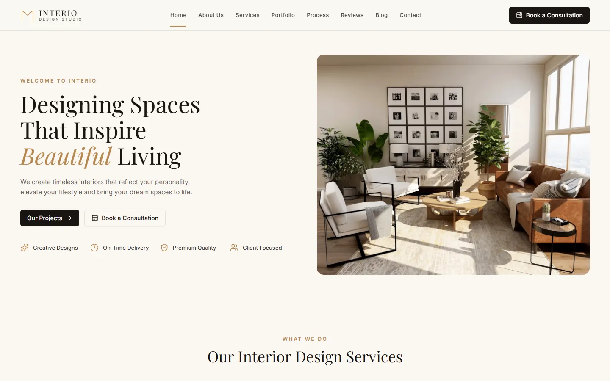
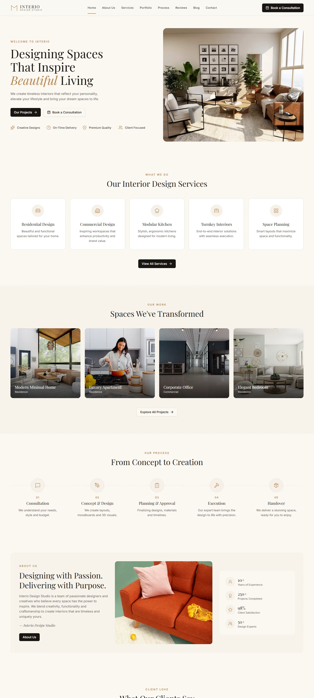

# Interio Design Studio

A pixel-matched, fully responsive interior design studio landing page — built with React, Vite, Tailwind CSS v4, and shadcn/ui.

**Live site:** [interio.codespanda.com](https://interio.codespanda.com/)



<details>
<summary>Full-page screenshot</summary>



</details>

## Sections

- Sticky header with mobile nav
- Hero with feature highlights
- Services grid
- Portfolio / "Spaces We've Transformed" gallery
- 5-step process timeline
- About + stats panel
- Client testimonials
- Blog preview + consultation CTA
- Footer with newsletter signup

## Tech Stack

- [React 19](https://react.dev/) + [TypeScript](https://www.typescriptlang.org/)
- [Vite](https://vite.dev/) for dev/build tooling
- [Tailwind CSS v4](https://tailwindcss.com/)
- [shadcn/ui](https://ui.shadcn.com/) (`button`, `card`, `badge`, `avatar`, `separator`, `input`)
- [lucide-react](https://lucide.dev/) icons

## Getting Started

```bash
npm install
npm run dev
```

Open [http://localhost:5173](http://localhost:5173).

### Build

```bash
npm run build
```

Outputs a production build to `dist/`.

## Deployment

Deployed automatically to GitHub Pages via [`.github/workflows/deploy.yml`](.github/workflows/deploy.yml) on every push to `main`, serving from the custom domain `interio.codespanda.com` (see `public/CNAME`).

## Project Structure

```
src/
  components/
    site/      # Page sections (Header, Hero, Services, Portfolio, ...)
    ui/         # shadcn/ui primitives
  lib/          # Utilities (cn helper)
  index.css     # Tailwind + design tokens
```
